# Contents
- [🤖座標推定](#🤖座標推定)
    - [⚙️概要](#⚙️概要)
    - [⚙️実装](#⚙️実装)
- [🤖座標推定](#🤖座標推定)
    - [⚙️概要](#⚙️概要)
    - [⚙️実装](#⚙️実装)
        - [🔩`extract_color_and_find_centroids(frame, HSV_vec, range_vec, area_threshold, max_num_objects)`](#🔩`extract_color_and_find_centroids(frame,-HSV_vec,-range_vec,-area_threshold,-max_num_objects)`)


---
# 🤖座標推定 

## ⚙️概要 

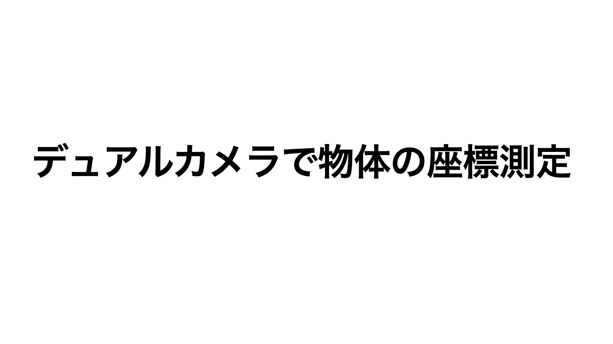
<hr>
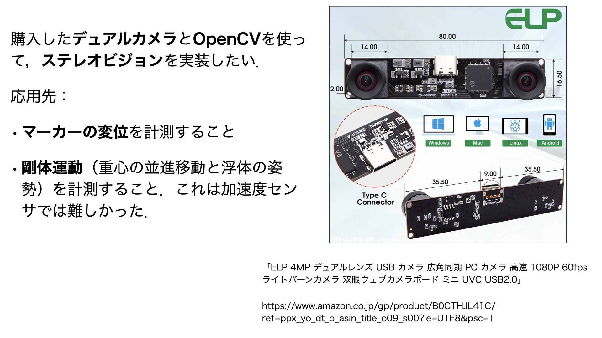
<hr>
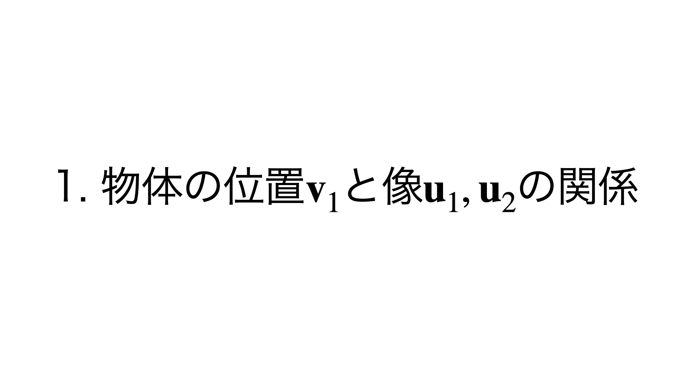
<hr>
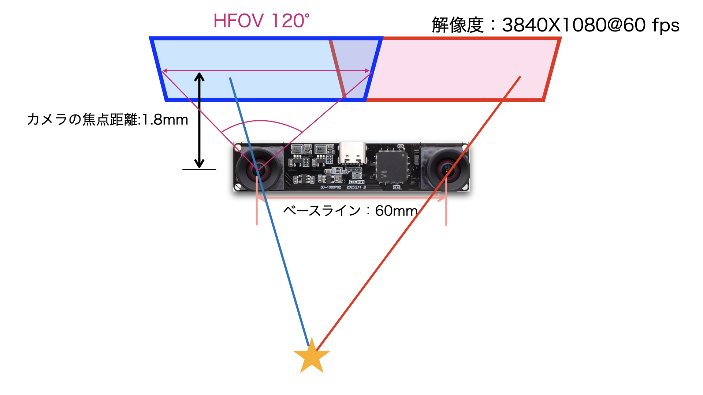
<hr>
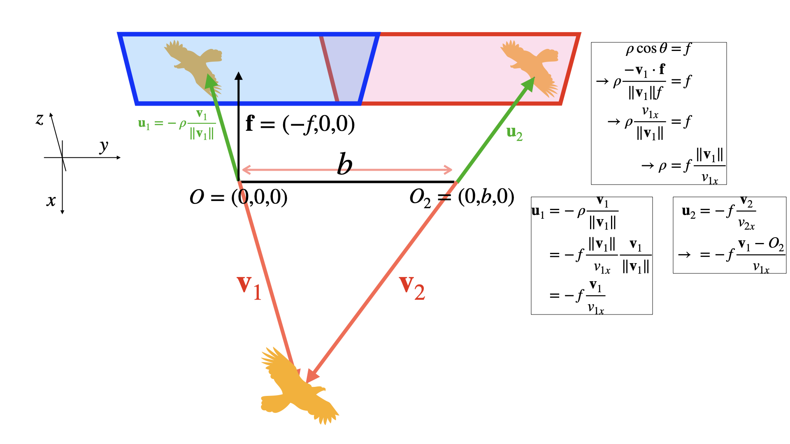
<hr>
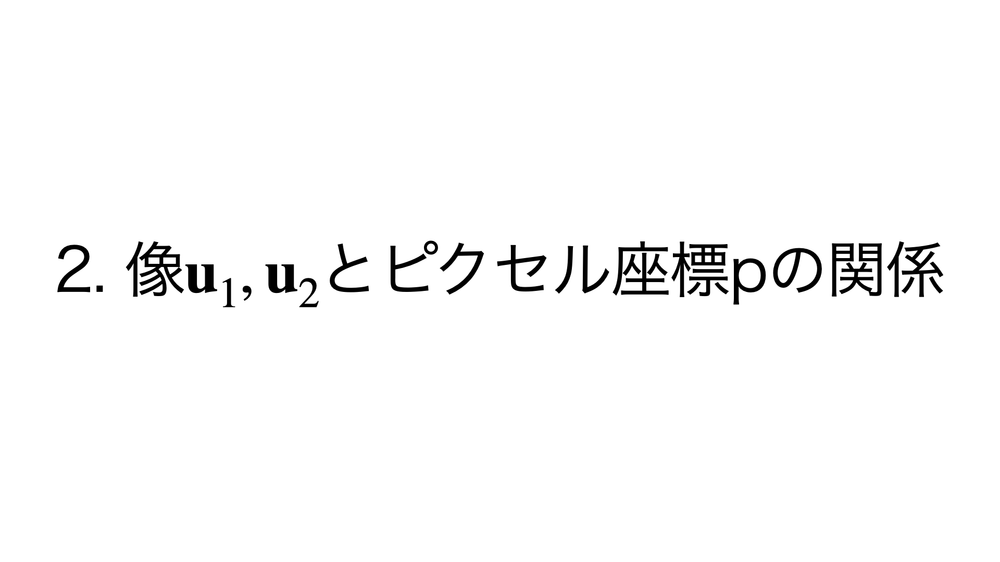
<hr>
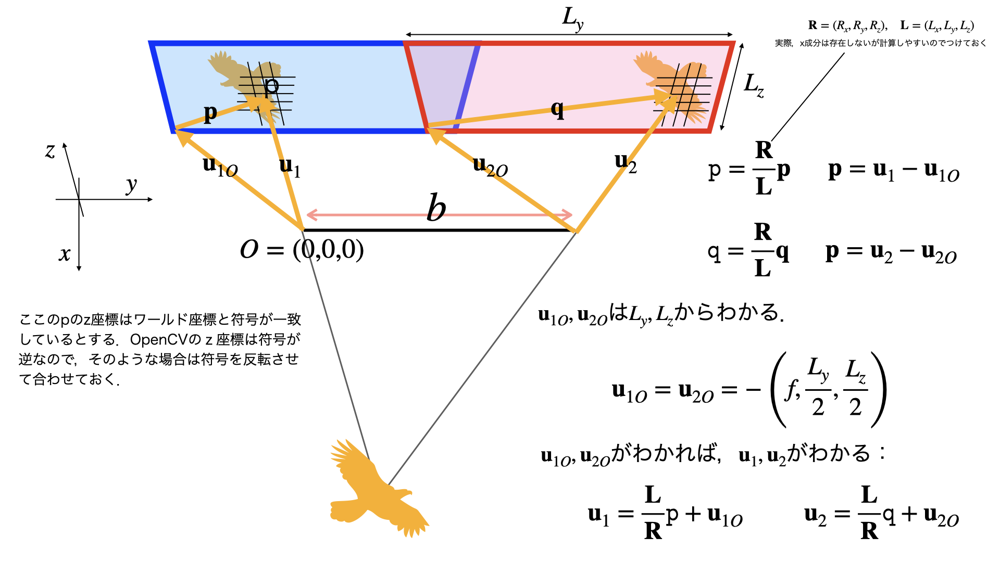
<hr>
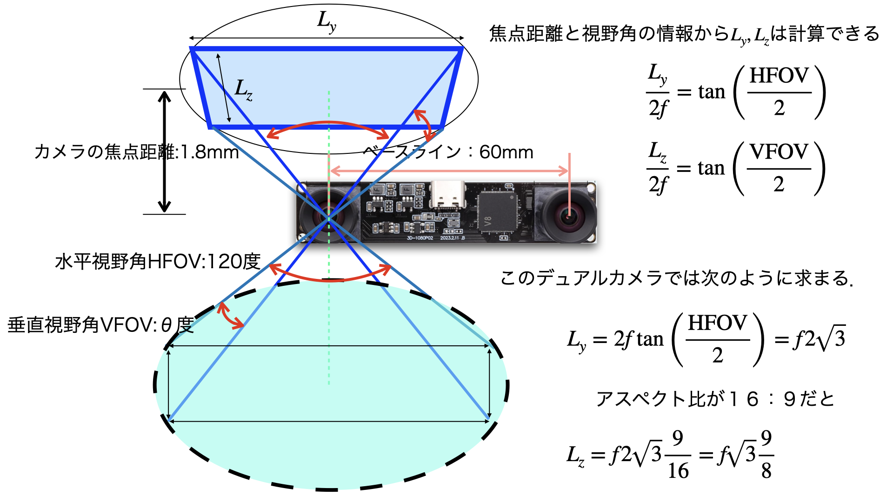
<hr>
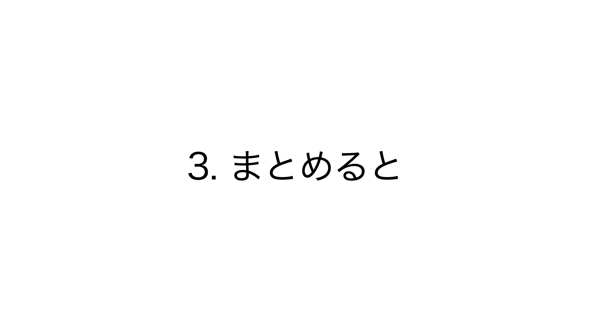
<hr>
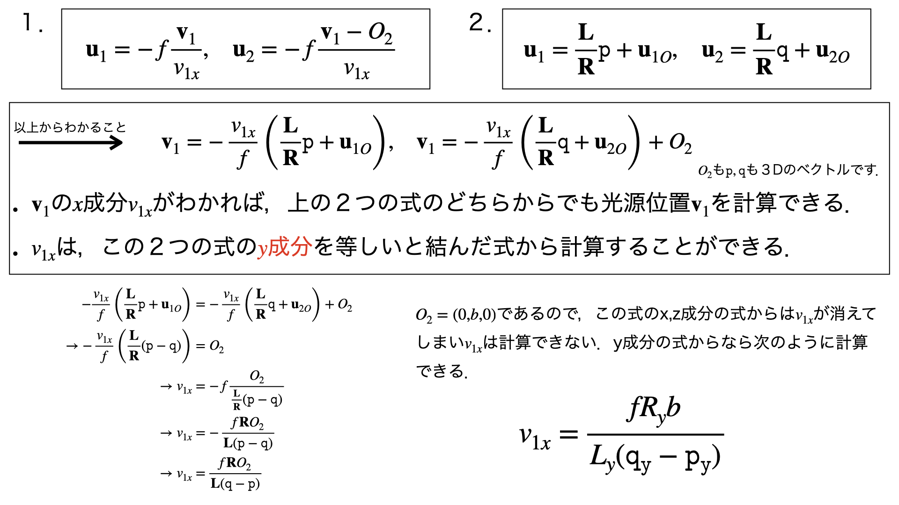
<hr>
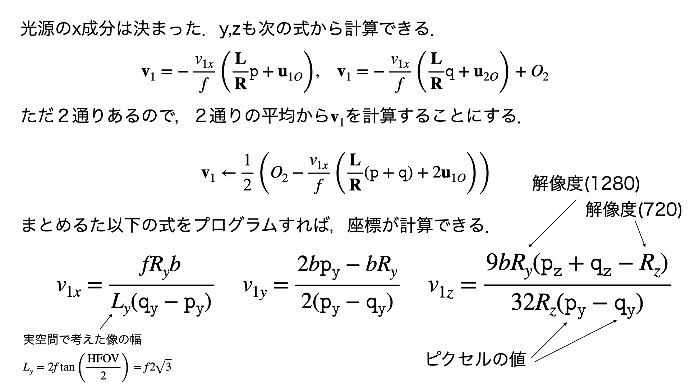

このようなわけで，下のようにプログラムすると，点の座標を推定することができる．

```python
def getEstimatedPosition(p,q,f=1.8, b=60., Ry=1280., Rz=720.,HFOV=120., aspect_ratio=16./9.):
#この変換は，ピンホールカメラモデルを仮定して，カメラの後ろ側にある面に投影された光源の位置を計算するものである．
#カメラを前から見て，左下が原点で，右がx軸の正方向，上がy軸の正方向，手前がz軸の正方向となるような座標系を仮定している．
[py,pz] = p
[qy,qz] = q
eps = 10.**-20    
v1x = (b * Ry)/(2 * math.tan(HFOV/180. * math.pi / 2.) * (-py + qy + eps))
v1y = (2*b*py - b*Ry)/(2*py - 2*qy + eps)
v1z = (b * Ry * (pz + qz - Rz))/(2 *aspect_ratio* (py - qy + eps) *Rz)    
return np.array([v1x, v1y, v1z])
```

## ⚙️実装 

実現したいこと：

- 指定した数の点を検出し，３次元座標を推定する．
- その点の座標にラベルを付け，座標を追跡する．
- 見失った点がある場合は，どのラベルの点が消えたかを判断できるようにする．

1. 初期状態で指定した数の点を検出し，ラベルを付ける．
ラベルは，左下を原点として，右がx軸の正方向，上がy軸の正方向として，座標の和が小さいものから順に1,2,3,...とする．
2. 大幅に点が移動することはないものとし，次のフレームでは，前のフレームの点との距離が最小となるようにラベルを付ける．(最小値を見つける際に，見失った点の座標は，前のフレームの座標とする．)

[./estimate_position.py#L1](./estimate_position.py#L1)

# 🤖座標推定 

## ⚙️概要 


<hr>

<hr>

<hr>

<hr>

<hr>

<hr>

<hr>

<hr>

<hr>

<hr>

<hr>
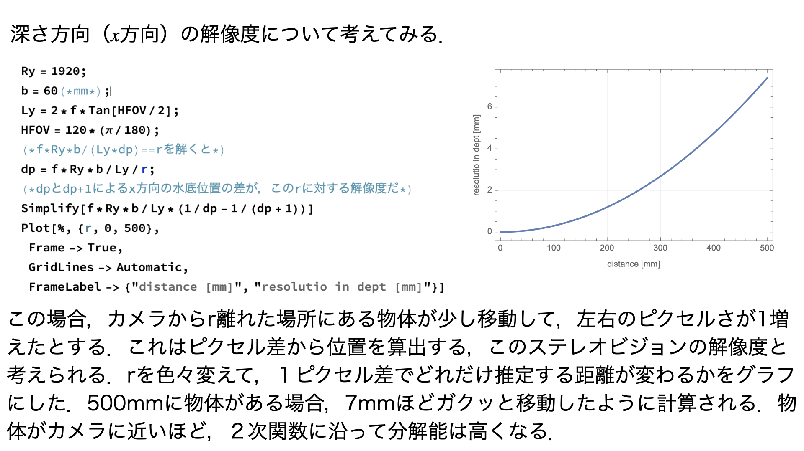

このようなわけで，下のようにプログラムすると，点の座標を推定することができる．

```python
def getEstimatedPosition(p,q,f=1.8, b=60., Ry=1280., Rz=720.,HFOV=120., aspect_ratio=16./9.):
#この変換は，ピンホールカメラモデルを仮定して，カメラの後ろ側にある面に投影された光源の位置を計算するものである．
#カメラを前から見て，左下が原点で，右がx軸の正方向，上がy軸の正方向，手前がz軸の正方向となるような座標系を仮定している．
[py,pz] = p
[qy,qz] = q
eps = 10.**-20    
v1x = (b * Ry)/(2 * math.tan(HFOV/180. * math.pi / 2.) * (-py + qy + eps))
v1y = (2*b*py - b*Ry)/(2*py - 2*qy + eps)
v1z = (b * Ry * (pz + qz - Rz))/(2 *aspect_ratio* (py - qy + eps) *Rz)    
return np.array([v1x, v1y, v1z])
```

## ⚙️実装 

実現したいこと：

- 指定した数の点を検出し，３次元座標を推定する．
- その点の座標にラベルを付け，座標を追跡する．
- 見失った点がある場合は，どのラベルの点が消えたかを判断できるようにする．

1. 初期状態で指定した数の点を検出し，ラベルを付ける．
ラベルは，左下を原点として，右がx軸の正方向，上がy軸の正方向として，座標の和が小さいものから順に1,2,3,...とする．
2. 大幅に点が移動することはないものとし，次のフレームでは，前のフレームの点との距離が最小となるようにラベルを付ける．(最小値を見つける際に，見失った点の座標は，前のフレームの座標とする．)

### 🔩`extract_color_and_find_centroids(frame, HSV_vec, range_vec, area_threshold, max_num_objects)` 

* `frame` : カメラからのフレーム
* `HSV_vec` : 抽出したい色のHSV値
* `range_vec` : 抽出したい色の範囲
* `area_threshold` : 抽出される面積の最小値
* `max_num_objects` : 抽出する最大のオブジェクト数

```python
def extract_color_and_find_centroids(frame, HSV_vec, range_vec, area_threshold, max_num_objects):    
hsv_frame = cv2.cvtColor(frame, cv2.COLOR_BGR2HSV)
hue_bounds = adjust_hue_bounds(HSV_vec[0], range_vec[0])
mask = create_mask(hsv_frame, hue_bounds, HSV_vec, range_vec)
mask = process_mask(mask)
contours, _ = cv2.findContours(mask, cv2.RETR_EXTERNAL, cv2.CHAIN_APPROX_SIMPLE)

centroids = []
centroids_sum = []
for contour in contours:
if cv2.contourArea(contour) >= area_threshold:
M = cv2.moments(contour)
if M["m00"] != 0:
cX = int(M["m10"] / M["m00"])
cY = int(M["m01"] / M["m00"])
centroids.append((cX, cY))
centroids_sum.append(cX + cY)
if len(centroids) >= max_num_objects:
break

def centroids_sum(centroid):
return centroid[0] + centroid[1]

return frame, mask, hsv_frame, sorted(centroids, key=centroids_sum)
```

**最終的に返される，`centroids`の順番，インデックスこそがラベルである．**

[./estimate_position_track.py#L1](./estimate_position_track.py#L1)

---
OpenCVでは，HSV（Hue, Saturation, Value）色空間を使用して画像の色を定義できる．
Hue(色相)は色を表し，Saturation(彩度)は色の鮮やかさを表し，Value(明度)は色の明るさを表す．
値の範囲は，Hueは0〜179，SaturationとValueは0〜255である．

H（色相）：0から179
S（彩度）：0から255
V（明度）：0から255

| 色 | Hueの範囲 |
|---|---|
| 赤 | 0〜10, 170〜180 |
| 緑 | 40〜80 |
| 青 | 100〜140 |

[./trash/mask.py#L2](./trash/mask.py#L2)

---
