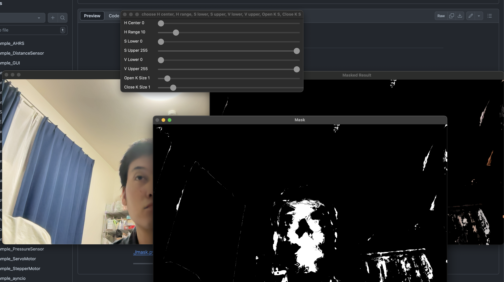

# Contents

- [🤖OpenCV](#🤖OpenCV)
    - [⚙️HSV Picker（映像のHSV色空間を確認できる）](#⚙️HSV-Picker（映像のHSV色空間を確認できる）)

---
# 🤖OpenCV 

## ⚙️HSV Picker（映像のHSV色空間を確認できる） 

トラックバーを使ってHSV色空間の各パラメータを調整し，
それに基づき，カメラ映像のマスク処理を行う．
カメラに映る物体のHSV色空間パラメタを確認することができる．

[./HSV_picker.py#L1](./HSV_picker.py#L1)

---
OpenCVでは，HSV（Hue, Saturation, Value）色空間を使用して画像の色を定義できる．
Hue(色相)は色を表し，Saturation(彩度)は色の鮮やかさを表し，Value(明度)は色の明るさを表す．
値の範囲は，Hueは0〜179，SaturationとValueは0〜255である．

H（色相）：0から179
S（彩度）：0から255
V（明度）：0から255

| 色 | Hueの範囲 |
|---|---|
| 赤 | 0〜10, 170〜180 |
| 緑 | 40〜80 |
| 青 | 100〜140 |

[./mask.py#L2](./mask.py#L2)

---
