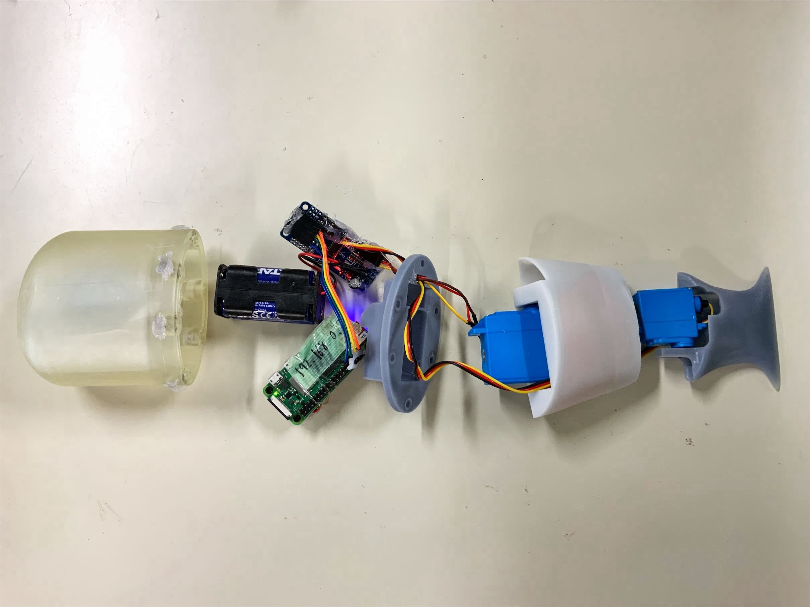
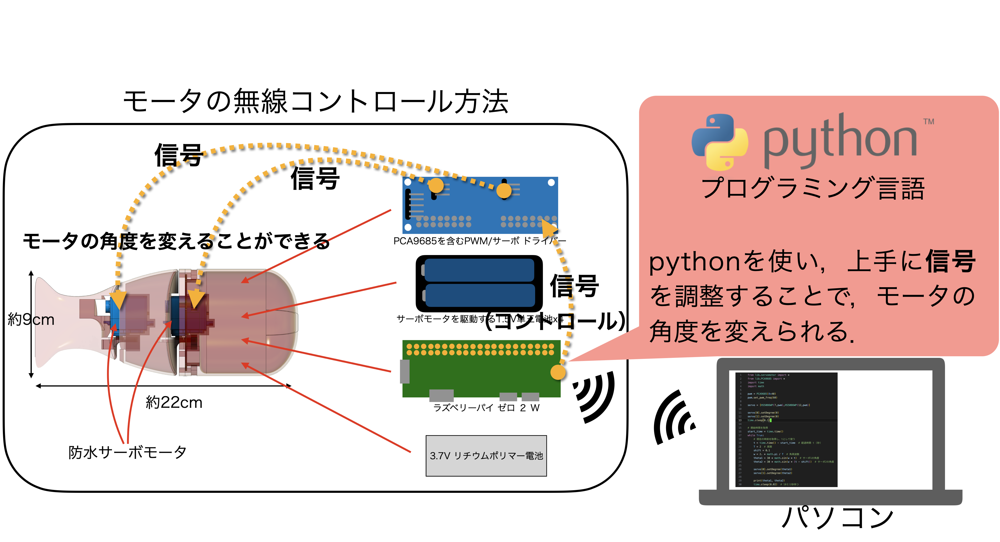
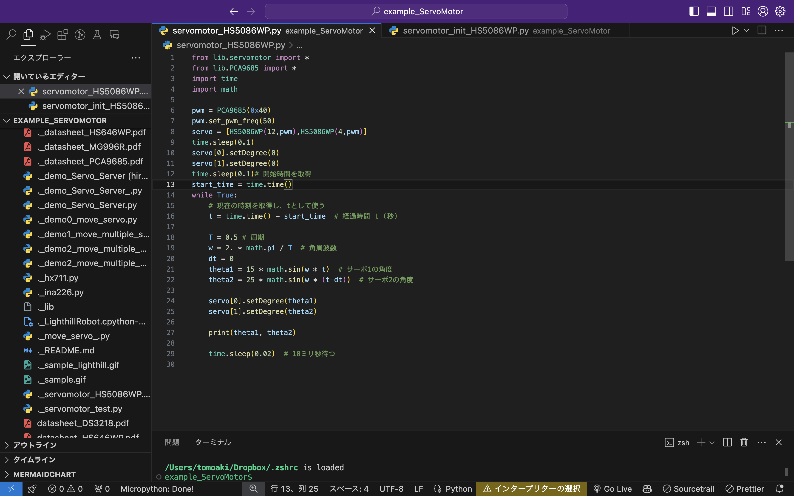
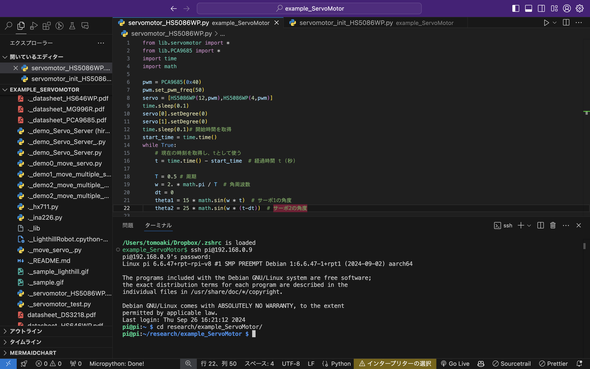
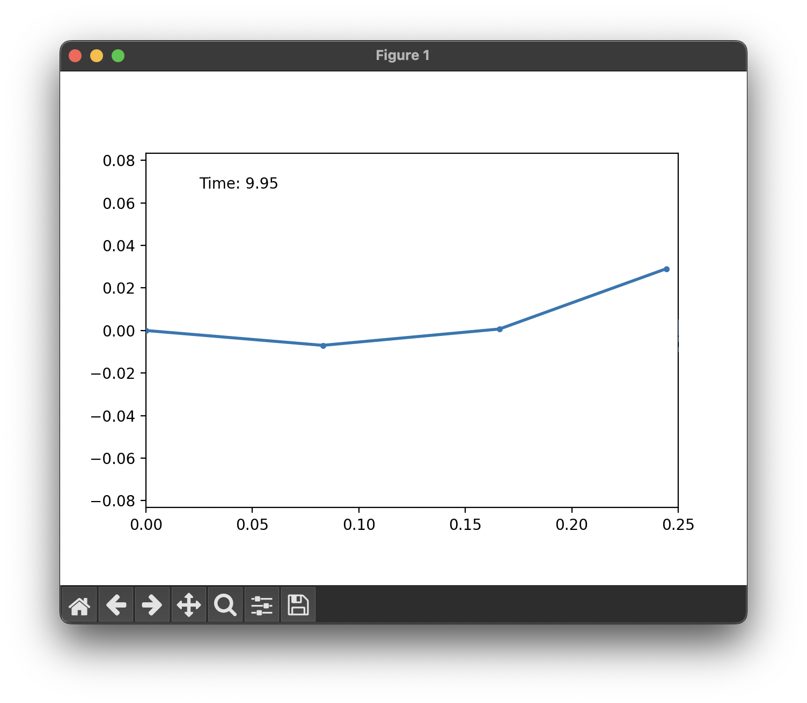

# Contents
- [🤖サーボモーターの制御](#🤖サーボモーターの制御)
    - [⚙️準備](#⚙️準備)
    - [⚙️例）サーボモーター1つの制御](#⚙️例）サーボモーター1つの制御)
    - [⚙️例）複数のサーボモーターの制御](#⚙️例）複数のサーボモーターの制御)
    - [⚙️⚙️特定のサーボモーター（MG996R/DS3218/HS-5086WP）クラス](#⚙️⚙️特定のサーボモーター（MG996R/DS3218/HS-5086WP）クラス)
        - [🔩🔩MG996R](#🔩🔩MG996R)
        - [🔩🔩DS3218](#🔩🔩DS3218)
        - [🔩🔩HS-5086WP](#🔩🔩HS-5086WP)
- [🤖魚ロボット](#🤖魚ロボット)
    - [⚙️無線魚ロボットの操作方法](#⚙️無線魚ロボットの操作方法)
        - [🔩事前準備](#🔩事前準備)
        - [🔩効率的な開発方法（VSCodeでラズパイのプログラムを編集して，ターミナルで実行）](#🔩効率的な開発方法（VSCodeでラズパイのプログラムを編集して，ターミナルで実行）)
    - [⚙️無線ライトヒル魚ロボットの操作方法](#⚙️無線ライトヒル魚ロボットの操作方法)
        - [🔩事前準備](#🔩事前準備)


---
# 🤖サーボモーターの制御 

## ⚙️準備 

このディレクトリ`python_micropython/example_ServoMotor`に`lib`をシンボリックリンクで作成しておく．

```
ln -s ../lib ./lib
```

下の方法で`lib`内の`servomotor`ディレクトリのファイルをインポートできる．

```
from lib.servomotor import *
```

上の命令で`lib`内の`servomotor`ディレクトリにある`__init__.py`が実行される．

`__init__.py`には，`from .servomotor import *`という命令が書かれている．
この意味は，`lib`内の`servomotor`内の`servomotor.py`に書かれている関数やクラスを全てインポートするという意味である．
これで，`servomotor.py`内の`servomotor`クラスを使うことができる．

<details>

---

<summary>Python パッケージ</summary>

あるディレクトリに，`__init__.py`というファイルがあると，そのディレクトリは**Pythonのパッケージ**となる．

```
from パッケージ名 import *
```

とすることで，そのパッケージ内の`__init__.py`がまず実行され，それに従って，パッケージ内のモジュールがインポートされる．
ここでは，`lib.servomotor`をパッケージとしてインポートしている．

---

</details>

## ⚙️例）サーボモーター1つの制御 

ここでは，以下のようにインポートしたが

```
from lib.servomotor import *
```

`lib/servomotor/servomotor.py`から`servomotor`クラスをインポートする，という意味で，次のようにもできる．
これで同じように`s = servomotor(0, 90)`としてサーボモーターを作成できる．

```
from lib.servomotor.servomotor import servomotor
```


[./demo0_move_servo.py#L1](./demo0_move_servo.py#L1)

---
## ⚙️例）複数のサーボモーターの制御 

やり方は，サーボモーター一つの場合と同じ．
これは，配列にサーボモーターのインスタンスを格納して実行した例．

## ⚙️⚙️特定のサーボモーター（MG996R/DS3218/HS-5086WP）クラス  

### 🔩🔩MG996R  

6Vで11kgf-cmのトルクを持つ．
$`\pm 60^\circ`$の範囲で動作する．

PWM周期は20ms，つまり周波数は1/0.02=0.5*10^2=50Hz．

1.5msのパルス幅で中立位置，0.5msで最小角度，2.5msで最大角度．

### 🔩🔩DS3218  

6Vで20kgf-cmのトルクを持つ．
$`\pm 180^\circ`$または$`\pm 270^\circ`$の範囲で動作する．

PWM周期は2.5ms，つまり周波数は1/0.0025=0.4*10^3=400Hz．

0.5-1.5msのパルス幅で中立位置，0.5-1.0msで最小角度，0.5-2.5msで最大角度．

### 🔩🔩HS-5086WP  

6Vで2.6kgf-cmのトルクを持つ．
$`\pm 60^\circ`$の範囲で動作する．

PWM周期は20ms，つまり周波数は1/0.02=0.5*10^2=50Hz．

0.9msのパルス幅で中立位置，0.5msで最小角度，2.1msで最大角度．
[../lib/servomotor/servomotor.py#L10](../lib/servomotor/servomotor.py#L10)

[./demo1_move_multiple_servos.py#L1](./demo1_move_multiple_servos.py#L1)

---
# 🤖魚ロボット 

ライトヒルの曲線に，ロボットの節が乗るようにするためのサーボモーターの角度の計算方法は他の場所で説明している．
ここでは，実査によって得られた角度を各モーターに与えてみる．やることは，複数のサーボモーターの制御と同じ．


## ⚙️無線魚ロボットの操作方法 

### 🔩事前準備 

* PCA9685のどのチャンネルにどのサーボモーターが接続されているかを確認しておく．
* 予めラズパイゼロは，`>*))))><`というSSIDのルーターに接続しておく．以下では，ラズパイゼロには，ルーターから，IPアドレス`192.168.0.9`が割り当てられたとする．
* PC（ラズパイゼロのpythonプログラムを編集するためのPC）も，同じルーターに接続しておく．





### 🔩効率的な開発方法（VSCodeでラズパイのプログラムを編集して，ターミナルで実行） 

過去のマウントを解除して，再度マウントする．

```sh
umount -f /Volumes/pi19216809
sshfs pi@192.168.0.9:/home/pi /Volumes/pi19216809
```

マウントしたディレクトリに移動して，VSCodeを起動する．

```sh
cd /Volumes/pi19216809/research/example_ServoMotor/
code ./
```



VSCodeのターミナルで，`ssh`でラズパイにログインする．

```sh
ssh pi@192.168.0.9
cd research/example_ServoMotor/
```



これで，VSCodeでラズパイのプログラムを編集して，ターミナルで実行することができる．実行例は次の通り．

```sh
python3 servomotor_HS5086WP.py 
```

ターミナルでラズパイの電源を切るときは，次を実行する．

```sh
sudo shutdown now
```

[./servomotor_HS5086WP.py#L1](./servomotor_HS5086WP.py#L1)

---
## ⚙️無線ライトヒル魚ロボットの操作方法 

### 🔩事前準備 

まず，無線魚ロボットと同じ準備をする．

違いは，c++で書かれたクラスをpythonから呼び出すための`LighthillRobot.cpython-311-aarch64-linux-gnu.so`ファイルを実行するpythonプログラムと同じばしょに置いておくこと．
このファイルは，pybind11によって生成されたもので，具体的な生成方法は，`cpp/builds/build_pybind11`で説明している．
元々のc++のLighthillRobotクラスは，`cpp/include/rootFinding.hpp`内で定義されている．

パラメタによっては，不自然にサーボモータが動くことがある．
これは，魚ロボの節が，LightHillの曲線に乗るためのサーボモータ角度をNewton法でうまく求められない場合である．

実際にロボットを動かさずに，サーボモータの動きをPCで確認するプログラムを準備している（`demo_runLightHillRobot1_animate_robot.py`）．
これはラズパイで実行せず，ローカルPCで実行する．matplotlibでアニメーションを見ることができる．



[./servomotor_HS5086WP_Lighthill.py#L1](./servomotor_HS5086WP_Lighthill.py#L1)

---
