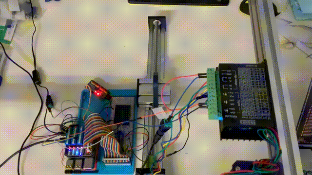

# Contents
- [🤖ステッピングモーターの制御](#🤖ステッピングモーターの制御)
- [🤖PCA9685を使用してステッピングモーターを制御する](#🤖PCA9685を使用してステッピングモーターを制御する)


---
# 🤖ステッピングモーターの制御 



ステッピングモーターは１パルスごとに一定の角度だけ回転する．
このStepperMotorクラスでは，StepperMotor.runメソッドを定義し，その中でモーターを制御する．

クラスの初期化は以下のように行う．

```python
motor = StepperMotor(dir_pin=12, step_pin=13, dxdq=8, pulse_per_rev=6400)
```

`dxdq`[mm]はモーターの規格で決まるものではなく，リニアガイドのピッチ[mm]である．
`pulse_per_rev`もモーターの規格で決まるものではなく，モータードライバの設定による．

```python
thread_process_loop = threading.Thread(target=motor.run, args=(position_func, stop_condition)) #スレッドを作成と同時に実行する関数をわたす
thread_process_loop.start() #スレッドを開始する
thread_process_loop.join() #実行したスレッドが終了するまで待つ
```

StepperMotor.runには，position_funcとstop_conditionという２つの関数を引数として渡す．

* position_funcは，リニアガイドにおける台の位置が時間とともにどのように移動するかを定義する関数である．
* stop_conditionは，runを終了するかどうかを判断する関数である．

run内では，run開始とともに，time.perf_counter()を使って，経過時間を計測しており，その時間をposition_funcに渡している．

例：

以下の例では，振幅A=2[mm]，周期T=0.1[s]の正弦波に乗って移動する台の位置を定義している．とても早いが問題なく動作した．

```python
A = 2
T = .1
def position_func(t):
return A * math.sin(2 * math.pi / T * t) * (1-math.exp(-t))
```

以下のように，振幅A=30[mm]，周期T=0.5[s]の正弦波に乗って移動する台の位置を定義しても問題なく動作する．

```python
A = 30
T = .5
def position_func(t):
return A * math.sin(2 * math.pi / T * t) * (1-math.exp(-t))
```

ただ，振幅A=40[mm]，周期T=0.5[s]だと，モーターが追いつかないようだ．

[./steppermotor_for_RPi.py#L1](./steppermotor_for_RPi.py#L1)

---
# 🤖PCA9685を使用してステッピングモーターを制御する 

PCA9685はパルスを出力するためのデバイスで，サーボモータだけでなくステッピングモータを回転させるパルスの生成にも使える．

TB6600を使って実際に行なった．

TB6600の設定：

SW1: ON
SW2: ON
SW3: OFF
SW4: ON
SW5: OFF
SW6: ON

PCA9685がステッピングモータパルス生成に利用されない理由は，
おそらくパルスの回数をカウントするのが難しいためだろう．

[./stepper_motor_using_PCA9685.py#L1](./stepper_motor_using_PCA9685.py#L1)

---
