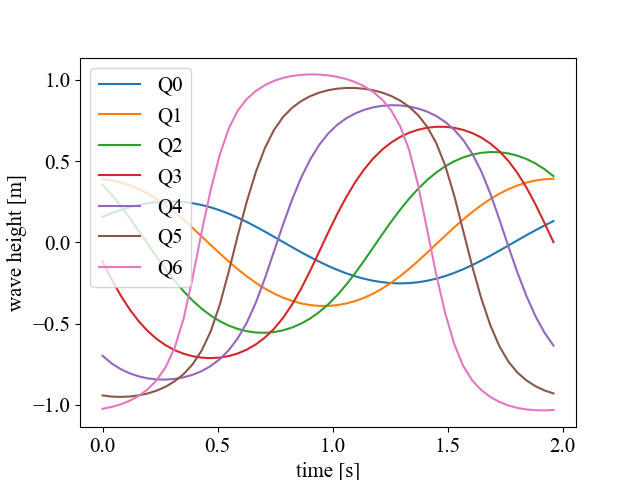
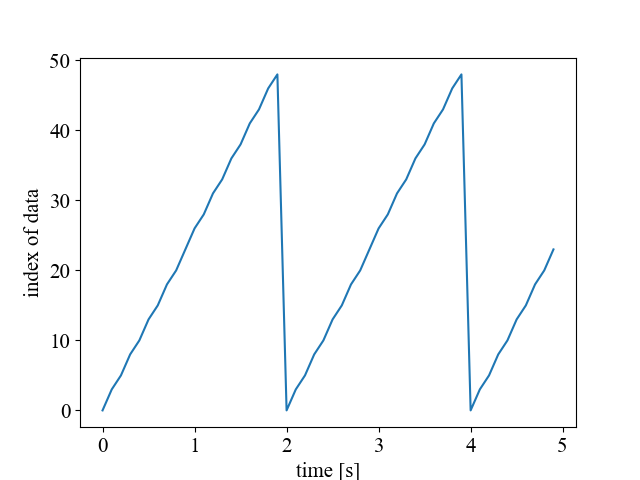
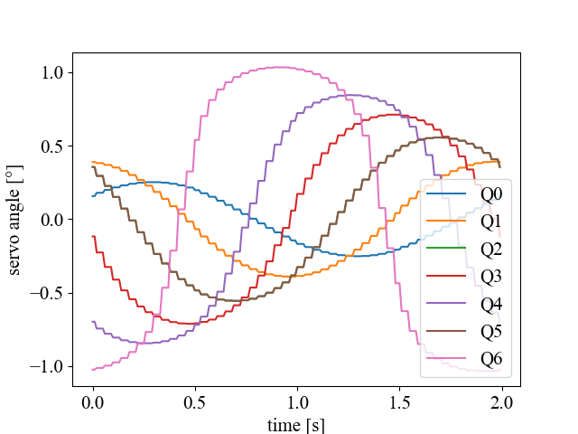

# 使い方

関節の角度.nbで魚の関節の時間変化を計算し，json形式で出力する．
jsonの内容は，check_data.pyで確認できる．

move_servo.pyを実行すれば，
jsonファイルを読み込みその内容に従うよう
サーボモーターが駆動する

ただし，
実際にサーボモーターを動かすためには，

* servomotorパッケージ
* PCA9685パッケージ

をpython_sharedからこのディレクトリにコピーしておくこと．

